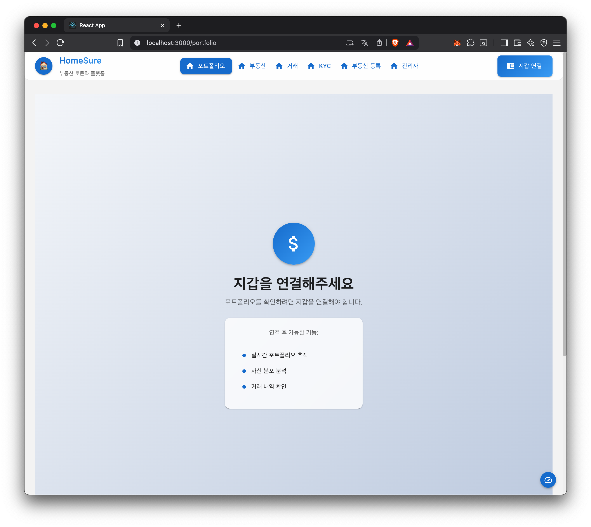
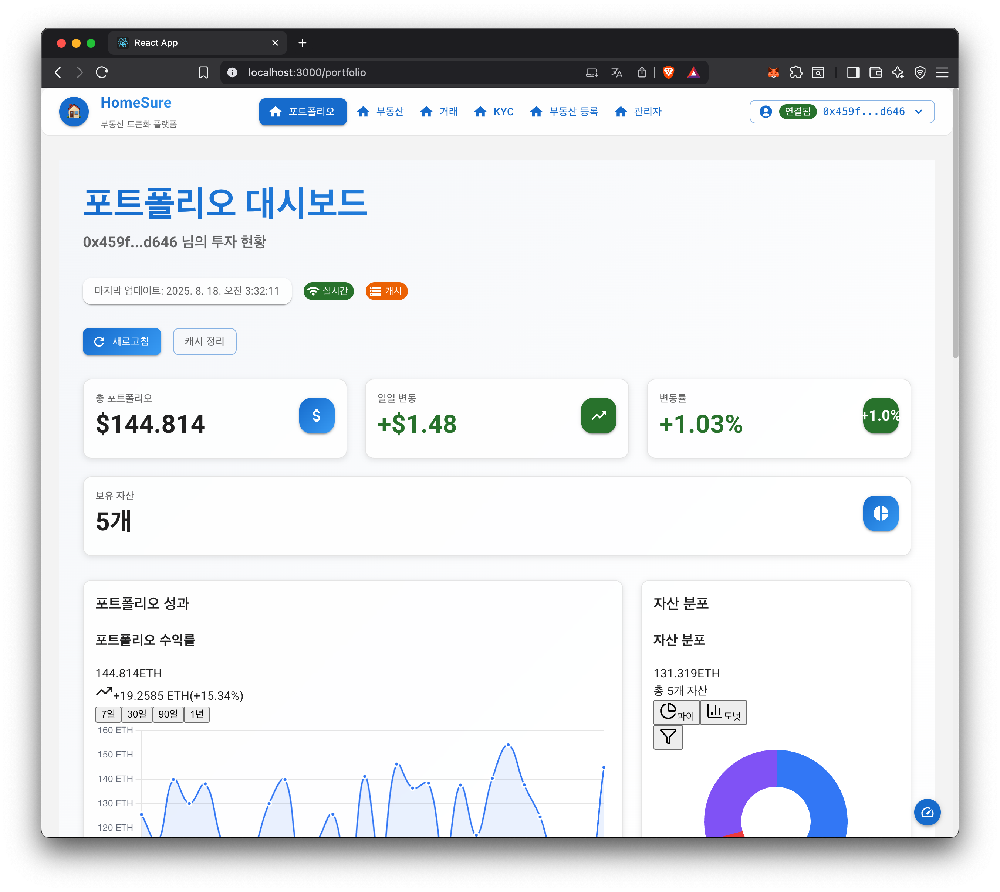
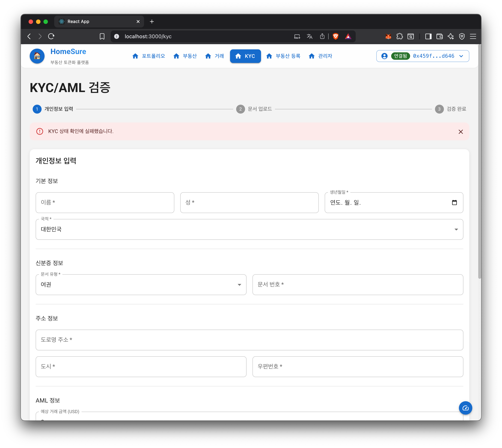
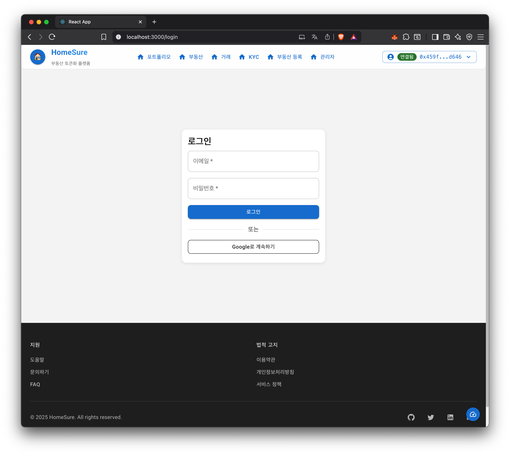
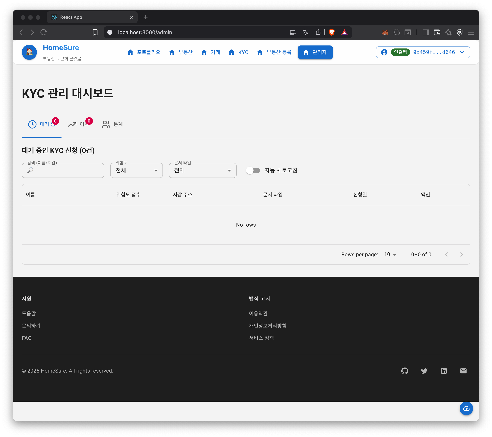

# HomeSure 데모 스크린샷

HomeSure 부동산 토큰화 플랫폼의 주요 화면들을 소개합니다.

## 스크린샷

### 1. 포트폴리오 페이지

지갑 연결 후 포트폴리오를 확인할 수 있는 페이지입니다.

### 2. 부동산 목록

토큰화된 부동산 목록을 조회하는 페이지입니다.

### 3. 거래 시스템

부동산 토큰의 매수/매도 거래를 수행하는 페이지입니다.

### 4. KYC 인증

사용자 신원 확인을 위한 KYC 인증 페이지입니다.

### 5. 관리자 대시보드

플랫폼 관리 및 모니터링을 위한 관리자 페이지입니다.

---
